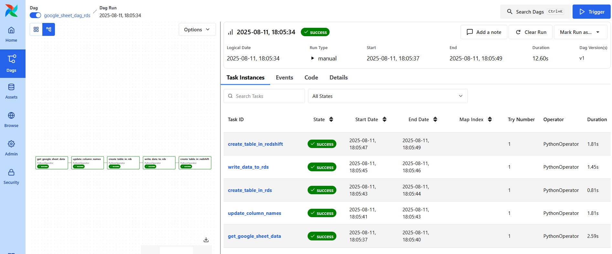

# Elite_data_eng_projects
Projects to stimulate transaction and access transactional API data, move to s3 and copy to redshift.

## Objectives

The aim of this project are:
1. Use terraform to provision data infrastructures
2. Move transactional data to amazon s3 then to amazon redshift 
3. Connect with an API to move the API data to amazon RDS, then to amazon redshift using airbyte
4. Employ airflow to ochestrate the data movements. 

## Steps employed in executing this project
1. I employed faker library of python programming language to generate transactional dataset and connect to google.
2. Gspread library was employed to connect with google API to access data stored on google sheet.
3. Created and used a docker image containing the relevant libraries necessary for both objectives.
4. For the transactional data tasks, I employed airflow to orchestrate my data workflow. My airflow dags included tasks to generate transactional data, load data to s3, create redshift table, and copy the data from s3 to redshift.

5. My airflow dags for the API data included tasks to get the api data, execute some data transformation, create table on rds, write data on the rds table, create rds table.

6. Utilized airbyte to move data from the rds to amazon redshift.